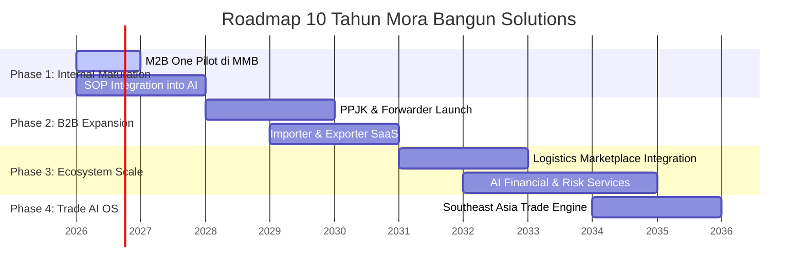

# 🌌 Mora Bangun Solutions (MBS) — Vision

> **"Build Once. Learn Forever. Run Autonomously."**

---

## 👁️ Visi Utama (The Vision)
**Menjadi perusahaan transformasi AI terkemuka di Asia Tenggara yang membangun "AI Business Brain" untuk industri perdagangan (trade), logistik, dan operasional industri.**

MBS tidak dibangun sebagai *software house* biasa yang membuat aplikasi kustom berdasarkan pesanan. MBS adalah sebuah **AI Product Studio** yang menciptakan sistem operasi cerdas (AI Operating System) untuk mengubah bisnis tradisional yang padat karya dan manual menjadi **Autonomous Business** yang berjalan secara cerdas dengan pengawasan minimal dari manusia.

---

## 🎯 Misi Kami (The Mission)
**Membangun AI Operating System yang memberdayakan bisnis untuk beroperasi lebih cepat, lebih pintar, dan berjalan secara mandiri (autonomously) melalui integrasi kecerdasan buatan langsung ke dalam alur kerja inti perusahaan.**

---

## 💎 Pilar Utama Visi MBS

### 1. Pergeseran Paradigma: "AI Business Brain"
Kami percaya bahwa arsitektur teknologi perusahaan modern tidak lagi cukup hanya terdiri dari ERP (database rekam data), CRM (pengelola hubungan pelanggan), dan Sistem Akuntansi. Harus ada satu komponen sentral baru: **AI Business Brain**.
*   **ERP/CRM/Accounting** adalah sistem pasif yang menunggu manusia untuk memasukkan dan mengolah data.
*   **AI Business Brain** adalah sistem aktif yang memahami SOP perusahaan, membaca semua dokumen/email, memantau risiko, mengambil keputusan taktis, dan mengeksekusi tindakan operasional secara mandiri.

```
┌─────────────────────────────────────────────────────────┐
│                   AI BUSINESS BRAIN                     │
│    (SOPs, Regulations, Document Reading, Risk Engine)   │
└────────────────────┬──────────────┬─────────────────────┘
                     │              │
                     ▼              ▼
           ┌───────────┐          ┌───────────┐
           │    ERP    │          │    CRM    │
           └───────────┘          └───────────┘
```

### 2. Dari Otomasi ke Otonomi (From Automation to Autonomy)
Mayoritas solusi AI saat ini hanya berfungsi sebagai chatbot (menjawab pertanyaan) atau otomasi alur kerja sederhana (IF-THEN rules). MBS melangkah lebih jauh dengan membangun **Autonomous Operations**—sistem agen AI multi-peran yang dapat memimpin departemen digital (seperti AI Board of Directors) dan menyelesaikan masalah operasional secara mandiri dengan kerangka *Human-in-the-Loop* (manusia sebagai validator akhir).

### 3. Kekuatan Kisah Nyata (The Power of Internal Pilot)
Produk unggulan pertama kami, **M2B One**, tidak dirancang di laboratorium teori. Ia lahir langsung dari kebutuhan mendesak dan "rasa sakit" operasional nyata di **PT. Mora Multi Berkah (MMB)**. 
*   Pendekatan ini mengikuti kisah sukses produk legendaris dunia: Amazon membangun infrastruktur internal sebelum meluncurkan **AWS**, dan Shopify lahir dari toko papan luncur salju milik pendirinya sendiri.
*   MMB adalah laboratorium hidup kami. Setiap modul AI yang kami buat diuji langsung di lapangan, terbukti memotong birokrasi, dan teruji secara klinis sebelum dikemas untuk dijual ke industri yang lebih luas.

---

## 🗺️ Roadmap Strategis 10 Tahun MBS



### 🏁 Phase 1: Internal Maturation & SOP Deep-Learning (Tahun 1-2)
*   **Fokus:** Menyempurnakan M2B One di lingkungan operasional PT. Mora Multi Berkah.
*   **Target:** Mengintegrasikan seluruh SOP logistik, bea cukai, dokumen (BL, Invoice, PL), dan komunikasi email/WhatsApp ke dalam memori AI. Mencapai tingkat otomasi dokumen >85% secara internal.

### 🚀 Phase 2: B2B Commercialization (Tahun 3-5)
*   **Fokus:** Menjual platform M2B One ke pasar luar sebagai solusi SaaS.
*   **Target Market:** Perusahaan PPJK (*Pengusaha Pengurusan Jasa Kepabeanan*), Freight Forwarder skala kecil-menengah, serta Importer/Exporter mandiri.
*   **Tujuan:** Membuktikan bahwa platform ini dapat mereplikasi efisiensi yang dirasakan MMB ke 50+ perusahaan eksternal.

### 🌐 Phase 3: Marketplace & Logistical Ecosystem (Tahun 6-8)
*   **Fokus:** Menghubungkan M2B One dengan ekosistem pelabuhan, surveyor, pergudangan, pelayaran (*shipping lines*), asuransi, dan lembaga pembiayaan perdagangan (*trade finance*).
*   **Target:** M2B One tidak lagi sekadar menjadi software PPJK, melainkan simpul logistik tempat transaksi antar-entitas terjadi secara otomatis difasilitasi oleh AI.

### 👑 Phase 4: The Ultimate AI Operating System for SE Asia Trade (Tahun 9-10)
*   **Fokus:** Menjadi tulang punggung operasional logistik ekspor-impor di regional Asia Tenggara.
*   **Target:** Setiap kontainer yang bergerak melintasi batas negara di kawasan ASEAN dikelola, dianalisis risikonya, divalidasi pajaknya, dan dilacak secara otonom oleh AI Operating System dari Mora Bangun Solutions.
